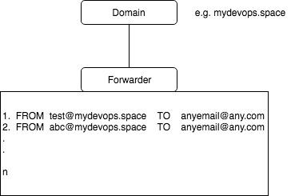
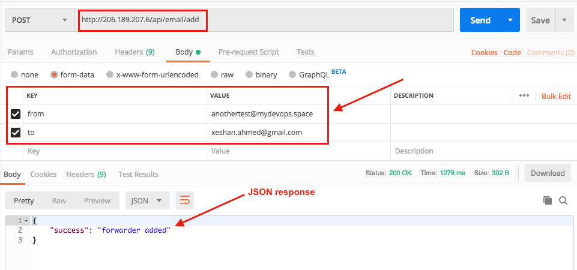
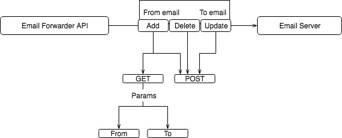
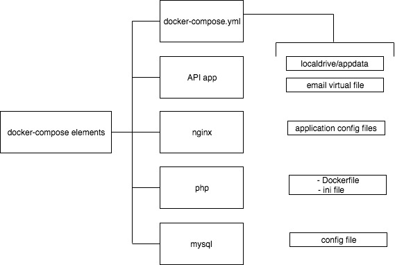
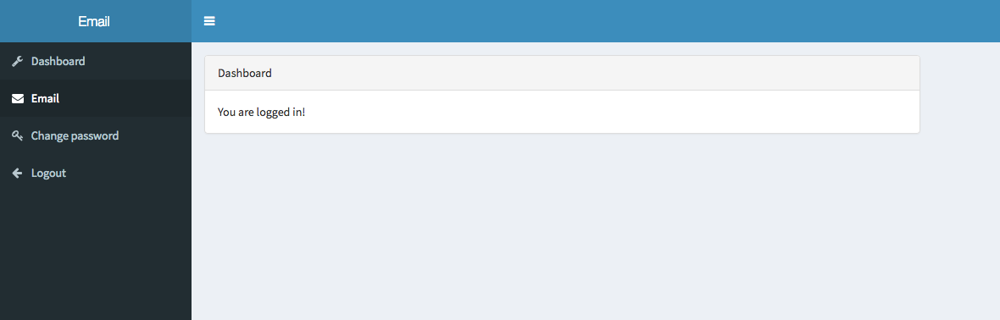
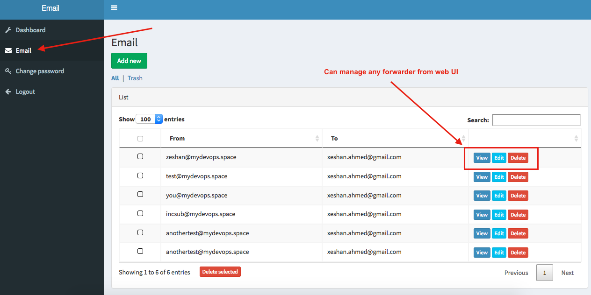

## Overview

This repository aimed to dockerise email forwarder application which contains API and Web UI


## Step: 1. Get it up and running


- Clone this repository.

``` bash
$ git clone https://github.com/xeshan/email-forwarder 
```

- Switch to the docker directory.

``` bash
$ cd email-forwarder 
```

- Start the stack.

``` bash
$ docker-compose up --build
```

if want to run complete structure as daemon (background process) then add `-d`

You have now cluster running with API app and email server.

## Step: 2. API deployment steps


Application is already set with all credentials which set in environment variables.  Next step is to clear cache and run database migration with data seeds.

``` bash
$ docker exec -it app bash
```

``` bash
$ composer install --no-dev
```

``` bash
$ php artisan cache:clear
```

``` bash
$ php artisan config:cache
```

``` bash
$ php artisan migrate --seed
```

## Step: 3. MX record setup


Point MX record to the server IP which emails you want forward

# That's it! all set now.

## App flow



## API 

URL -> localhost or ip-address

- URL/api/email/add   		-> add new forwarder
- URL/api/email/delete     	-> delete forwarder
- URL/api/email/update		-> update forwarder

## API testing with Postman



## API flow



## docker elements




# Web UI

- http://ip-address/

user: admin@admin.com

password: password

note: u/p was seeded at time data seeds run with migration




limitation ::> currently its support only single (from) domain forwarding.


